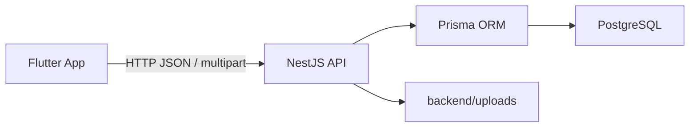

# Photo-Only Instagram Clone Lesson Plan

This project is designed for a complete beginner who wants to learn backend development by building something real.

## How to Study

For each lesson:

1. Read the concept.
2. Run the code.
3. Change one small thing yourself.
4. Test the feature before moving on.

## Lesson 1: Full-Stack Map

Flutter is the client. It draws screens and sends HTTP requests.

NestJS is the server. It receives requests, checks rules, talks to the database, and returns JSON.

PostgreSQL is the database. It stores users, posts, likes, and comments.

The upload folder stores local photo files during development.

Checkpoint: you can explain what happens when a user taps "Post photo".

## Lesson 2: NestJS Basics

Important words:

- Module: groups related backend code.
- Controller: defines API routes.
- Service: contains business logic.
- DTO: describes incoming request data.
- Guard: protects routes from unauthenticated users.

Checkpoint: run `GET /health` and see the backend respond.

## Lesson 3: Database With Prisma

Tables in this app:

- `User`: account information.
- `Post`: one uploaded photo.
- `Like`: connects a user to a post they liked.
- `Comment`: text written by a user on a post.

Checkpoint: open Prisma Studio and find the seeded user.

## Lesson 4: Authentication

Signup hashes the password with bcrypt before saving it.

Login compares the typed password with the saved password hash.

JWT is a signed token. Flutter stores it securely and sends it on protected requests.

Checkpoint: sign up, restart the app, and stay logged in.

## Lesson 5: Posts

Creating a post uses multipart form data because it contains a file and text.

The backend saves the file to `backend/uploads` and stores the photo URL in PostgreSQL.

Checkpoint: upload a photo and see it appear in the feed.

## Lesson 6: Likes

A like is not just a number. It is a row in the `Like` table with:

- `userId`
- `postId`

The unique rule prevents one user from liking the same post twice.

Checkpoint: like and unlike a post, then refresh the feed.

## Lesson 7: Comments

A comment belongs to one user and one post.

Only the owner of a comment can delete it.

Checkpoint: add a comment and confirm the feed comment count updates.

## Lesson 8: Share

Sharing is a Flutter feature here. The backend does not need a share table for v1.

Checkpoint: tap share and see the native share sheet.

## Lesson 9: Debugging

Use these clues:

- `400`: request data is invalid.
- `401`: token is missing or invalid.
- `403`: logged in, but not allowed.
- `404`: item was not found.
- `409`: duplicate email or conflicting data.
- `500`: backend bug or server setup problem.

Checkpoint: intentionally use a wrong password and read the error.
